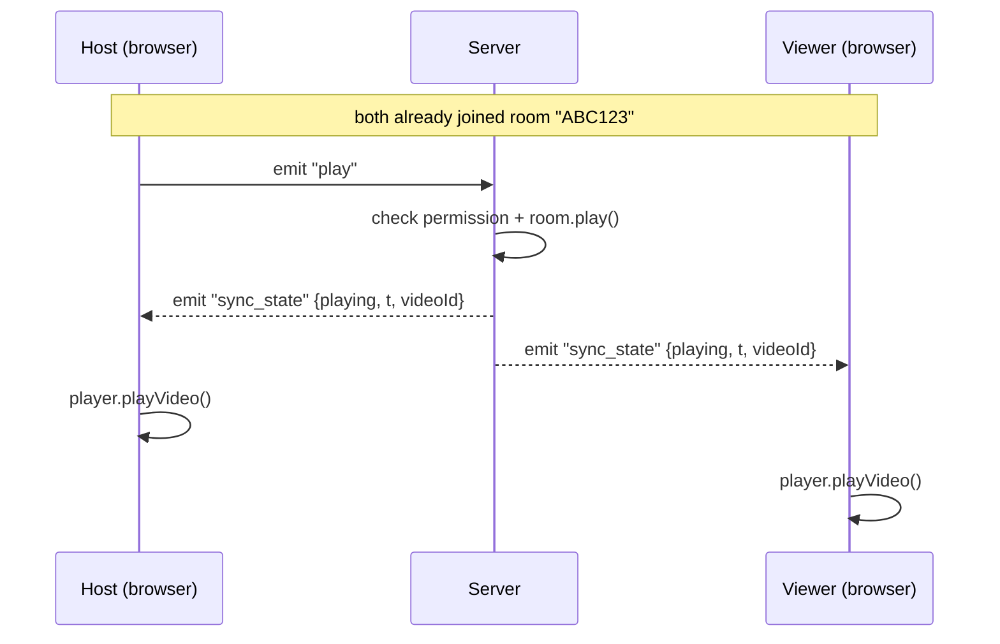

# How WebSockets Integrate with the Flow

**WatchMe — Real-time YouTube Watch Party**

The watch party is built around a persistent **WebSocket connection (Socket.IO)** between every browser and the server. Plain HTTP is used only to create or look up a room; **all real-time playback synchronization travels over the WebSocket**. This lets the server **push** updates to every viewer the instant the host acts — no polling — keeping everyone in sync within about a second.

## Connection & Rooms

When a user opens a room, the client establishes a WebSocket to the server and emits `join_room` with the 6-character code. The server places that socket into a Socket.IO **room** keyed by the code (`socket.join(code)`). Every later broadcast is scoped to that room, so events reach only the people watching together — never other rooms.

## Playback Sync Flow

A single playback action travels through the socket like this:

1. **Host / moderator acts** — clicks Play, Pause, Seek, or Change Video in the UI.
2. **Client emits an event** over the WebSocket, e.g. `socket.emit("play")`.
3. **Server validates & updates state** — it checks the sender's role/permission, then updates the authoritative in-memory room state (play state, current time, video).
4. **Server broadcasts** one `sync_state` event to everyone in the room: `io.to(code).emit("sync_state", {…})`.
5. **Every client applies it** — each viewer receives `sync_state` and drives its YouTube player (play / pause / seek / load) to match.

Because the **server** is the single source of truth and the **same** `sync_state` reaches all clients, the host and every viewer converge on identical playback — the host's own video also updates from this broadcast, not from the click directly.

## Key WebSocket Events

**Client → Server** (host / moderator emits)

| Event | Purpose |
| --- | --- |
| `join_room` | Enter a room by its 6-character code |
| `play` / `pause` | Start or stop playback for the whole room |
| `seek` | Jump to a specific timestamp |
| `change_video` | Load a different YouTube video for everyone |
| `leave_room` | Leave the room |

**Server → Clients** (broadcast to the room)

| Event | Purpose |
| --- | --- |
| `sync_state` | Authoritative playback state: `playState`, `currentTime`, `videoId` |
| `user_joined` / `user_left` | Live participant list changes |
| `role_assigned` | A participant was promoted / demoted / made host |
| `removed_from_room` | This client was removed by the host |

## Why WebSockets (and not HTTP polling)

Playback sync needs **low-latency, bidirectional, server-initiated** messaging: the host acts at an unpredictable moment and every viewer must be notified immediately. A WebSocket keeps one connection open for the session, so the server can push a `sync_state` the moment anything changes — far cheaper and faster than clients repeatedly polling an HTTP endpoint — and it also powers live presence (join/leave) and role changes over the same channel.
